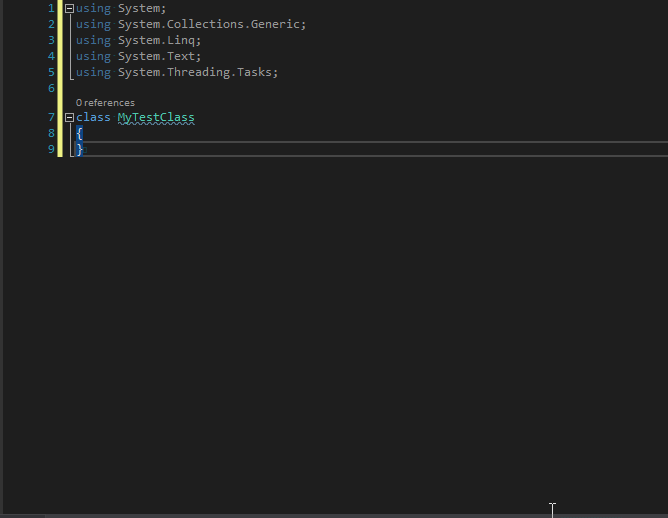

# ResharperTemplates
My custom [ReSharper Code Templates](https://www.jetbrains.com/resharper/features/code_templates.html) for Visual Studio. Either copy & paste individual templates in ReSharpers *Template Explorer* or import the *.DotSettings files.

Here's an example of using the templates for MS Test:

